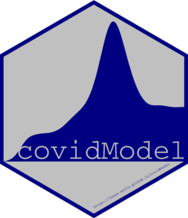

# covidModel 

<!-- badges: start -->
[](https://www.tidyverse.org/lifecycle/#experimental)
[](https://codecov.io/gh/jesse-smith/covidModel?branch=master)
[](https://github.com/jesse-smith/covidModel/actions)
<!-- badges: end -->

The goal of covidModel is to provide inference and prediction functions to aid 
understanding of the COVID-19 epidemic in Shelby County. The focus is primarily
on temporal data, though other methods may be included.

## Installation

You can install the development version of covidModel with:

``` r
install.packages("devtools")
devtools::install_github("covidModel")
```
